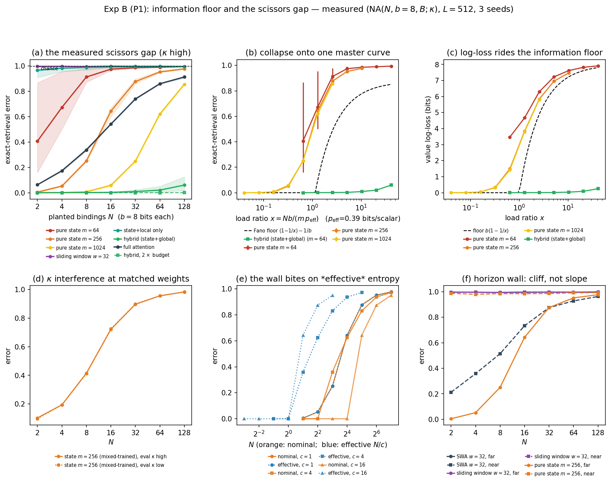
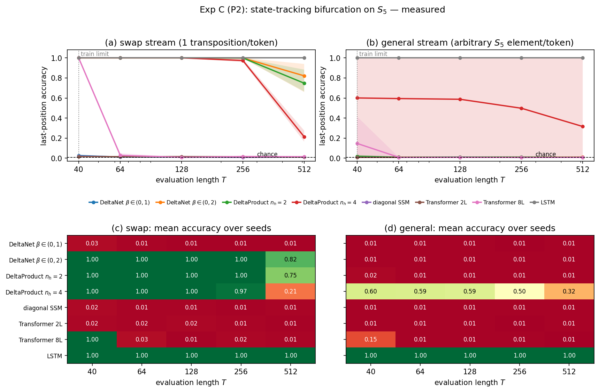

# Capability from Access Structure, Not Scale

Official repository for **"Capability from Access Structure, Not Scale: Lower
Bounds and Pre-Registered Tests for Hybrid Sequence Models"** (arXiv:2607.14144).

We turn the paper's five *schematic* prediction figures into *measured* ones,
under a pre-registered protocol frozen before any data were collected
([PREREGISTRATION.md](PREREGISTRATION.md)). Headline result: capability in the
common regime (fixed depth, no chain-of-thought, fixed per-token compute) is set
by a model's **access structure**, not its scale.

## The two core results

**The scissors gap (Exp B, P1).** A hybrid with the *same* 64-scalar recurrent
state as a pure-state model, plus one global-attention layer, stays near-zero
error while the pure state saturates to chance as the binding load grows — a
0.994-vs-0.000 gap at N=128. Access-completeness, not capacity, rescues retrieval.



**The state-tracking bifurcation (Exp C, P2).** On composed S5 state tracking,
architectures split cleanly by access structure: DeltaProduct (n_h≥2) and LSTM
length-generalize; DeltaNet β∈(0,1), diagonal SSM, and Transformers collapse
beyond training length — regardless of parameter count.



## Results at a glance

Full scorecard and per-cell numbers: [REPORT.md](REPORT.md). Verdicts follow the
frozen criteria in [PREREGISTRATION.md](PREREGISTRATION.md).
**Overall: 11 SUPPORTED · 7 PARTIAL · 1 FAILED** of 19 pre-registered predictions.

| Prediction | Experiment | Verdict |
|---|---|---|
| P1 information floor rises for every pure-state size | B (B-i) | ✅ Supported |
| P1 curves collapse onto one load-ratio master curve | B (B-ii) | 🟡 Partial (holds for the two larger states) |
| P1 **scissors gap**: hybrid ≪ pure state at matched state | B (B-iii) | 🟡 Partial → ✅ at 24k steps |
| P1 no architecture beats the Fano floor | B (B-v) | ✅ Supported |
| P1 local-window hybrid is *not* rescued | B (B-viii) | ✅ Supported |
| P2 DeltaNet β∈(0,1) fails both streams (starred) | C (C-i) | ✅ Supported |
| P2 DeltaNet β∈(0,2) passes the swap stream | C (C-ii) | ✅ Supported |
| P2 **n_h staircase** on the general stream | C (C-iii) | ✅ Supported (3 seeds); brittle at 8 seeds |
| P2 Transformers fail beyond training length | C (C-iv) | ✅ Supported |
| P2 diagonal SSM fails | C (C-v) | ✅ Supported |
| P2 LSTM passes both streams | C (C-vi) | ✅ Supported |
| PRH replication: cross-family alignment grows with scale | A (A-i) | ✅ Supported |
| **Dissociation**: alignment does *not* predict capability gap | A (A-iv) | ✅ Supported |
| Attention beats SSM/RNN at matched scale (≥30pp) | A (A-ii) | 🟡 Partial (direction unanimous; margin ≥30pp vs Mamba missed) |
| P3 channel commensurability (similarity operationalization) | D (D-i) | ❌ Failed — reported as a failed CCH prediction |
| **Composite conjunction witness** (state-tracking ∧ retrieval) | E | ✅ Witness met |

The one **failed** prediction (D-i) is reported as a failure of CCH's P3 as
operationalized, per the paper's reporting commitments — random-init channels
turn out to be a kNN-alignment *ceiling*, not the floor the schematic assumed.

## Quickstart

Reproduce **Experiment E** (the composite conjunction witness) end-to-end —
train the 5 frozen arms × 3 seeds, analyze, and regenerate the figure:

```bash
bash run_expE.sh
```

Requires a CUDA GPU; pick one with `CUDA_VISIBLE_DEVICES=0 bash run_expE.sh`.
The script skips already-finished outputs, so it is safe to re-run.

**No GPU?** Every figure regenerates from the result JSONs already shipped under
`results/` — no training needed:

```bash
python expB_floor/plot_b.py        # figs/expB_floor.png  (scissors gap)
python expC_s5/plot_c.py           # figs/expC_bifurcation.png
python expA_dissociation/plot_a.py # figs/expA_dissociation.png
python analyze_expE.py && python expE_composite/plot_e.py  # figs/expE_witness.png
```

## Repository layout

This repository is the `experiments/` directory referenced throughout the paper
(paths the paper writes as `experiments/census_frontier.py`,
`experiments/PREREGISTRATION.md`, etc. correspond to the same files at the root here).

- `PREREGISTRATION.md` — the pre-registration protocol (frozen 2026-07-10) and its amendments.
- `REPORT.md` — full results write-up and per-prediction scorecard.
- `common/` — shared model, task, and launcher code.
- `expA_dissociation/` — Exp A: representational convergence vs. capability dissociation (Pythia/Mamba/RWKV).
- `expB_floor/` — Exp B (P1): information floor / scissors gap.
- `expC_s5/` — Exp C (P2): S5 state-tracking bifurcation.
- `expD_comm/` — Exp D (P3/P3'): channel commensurability / complementarity.
- `expE_composite/` — Exp E: composite conjunction witness (`run_expE.sh` drives this).
- `collision_naturalness/` — Appendix G.6: write-time key-separability corpus measurement.
- `census_frontier.py` — Appendix D: frontier-subset rule for the architecture census.
- `results/` — per-experiment result summaries (JSON) behind the paper's figures.
- `figs/` — the paper's measured figures (PDF/PNG).

Trained-model checkpoints (`*.pt`) are not included to keep the repository light;
the result JSONs under `results/` are sufficient to regenerate every figure.
